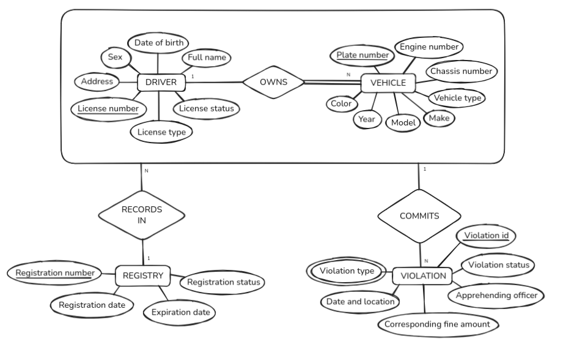

# CMSC 127 Project

This information system will be a Land Transportation Office (LTO) Information Management System, designed to support the recording and management of drivers, motor vehicles, registrations, and traffic violations in the Philippines. The system aims to simulate a simplified version of real-world LTO operations, emphasizing proper database design, data integrity, and efficient query processing.

## Contributors

- Lubrin, Clarence
- Paguirigan, Jorge
- Usares, Jerome

## ERD Design



# How to run the application

## Download dependencies

Create the .venv environment
```
python -m venv .venv
```

Activate the python virtual environment
```
source .venv/bin/activate
```

Download the dependencies
```
pip install -r requirements.txt
```

## How to initialize the MariaDB Database

Give the script run permissions
```
chmod +x init.sh
```

Run the init script
```
sudo ./init.sh
```
or
```
sudo bash <ROOT_LOCATION_OF_REPOSITORY>/init.sh
```

## Run the server

Start the server
```
uvicorn app:app --reload
```

## How to create/delete users as a Database Administrator

```
admin.py (--create | --delete | --list) [--username USERNAME] [--password PASSWORD]
```